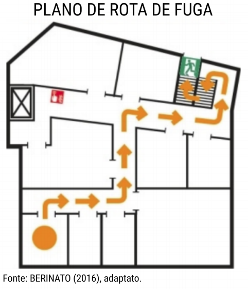
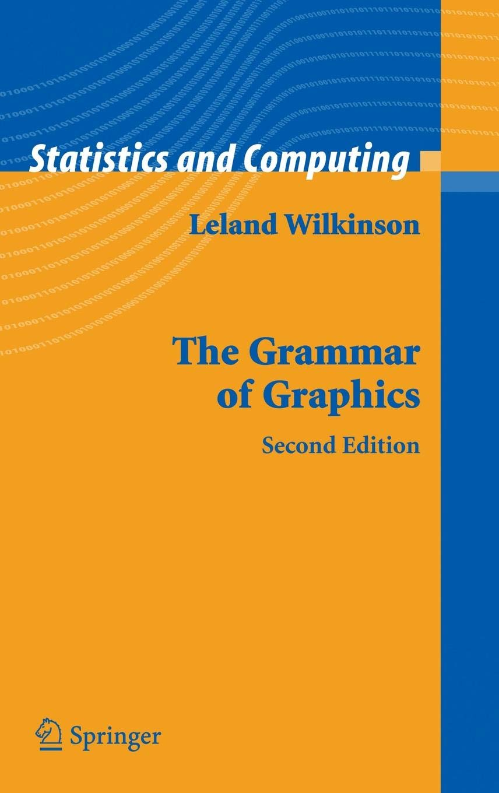
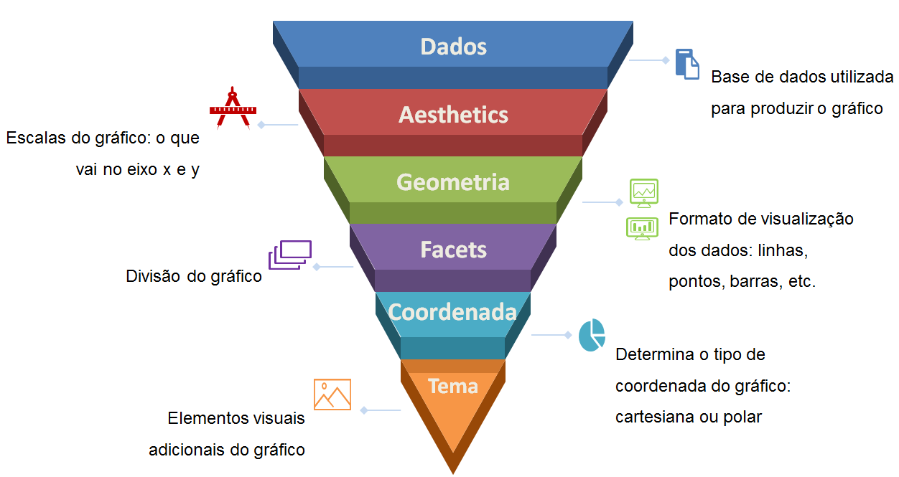

# Visualização de dados

## Por que construir gráficos?

&nbsp;
&nbsp;

<div style="width: 100%;">

<p style="border:3px; border-style:dashed; border-color:#3D9970; padding: 1em;font-size:30px;"> Saia desta sala. Vire à direita e caminhe 3 metros até o final do corredor, onde você estará em frente a uma grande sala de conferências. Vire à esquerda e caminhe mais 3 metros até chegar ao final do corredor. À sua esquerda estará um alarme de incêndio, perto do elevador. À sua direita, no final do corredor, há uma escadaria. Não vá ao elevador. Vire à direita e caminhe mais 4 metros até o final do corredor, vire à esquerda e desça pelas escadas. Desça dois lances de escadas e saia do prédio na porta na parte inferior das escadas. </p>

Fonte: Adaptado de Berinato (2016)

</div>


## Por que construir gráficos?

&nbsp;
&nbsp;

<center></center>


## Por que construir gráficos?

&nbsp;
&nbsp;

<video width="800px" height="700px" controls>
  <source src="dino.mp4" type="video/mp4">
</video>

# Ggplot - Grammar of graphics

## Construção de gráficos em camadas

&nbsp;
&nbsp;

O ggplot é um pacote criado pelo **Hadley Wickham** com o objetivo de operacionalizar a teoria do livro "The Grammar of Graphics" de Leland Wilkinson.

<div style="float: left; width: 50%;">

<center></center>

</div>


<div style="float: right; width: 50%;">

<center></center>

</div>


## Por que o nome gramática de gráficos?

&nbsp;
&nbsp;

A ideia básica do ggplot é a de que um gráfico é construído a partir de camadas de elementos, assim como uma frase:

&nbsp;
&nbsp;

<center><div style="width: 50%;">

 <p style="border:3px; border-style:dashed; border-color:#FF4136; padding: 1em;font-size:40px;"> **O JAIR FEZ UM PÉSSIMO DISCURSO** </p>
</div></center>

&nbsp;
&nbsp;

Se os adjetivos, verbos, ou substantivos fossem alterados, o sentido da frase seria totalmente alterado.

## A Gramática dos Gráficos

&nbsp;
&nbsp;

<center></center>


# 1ª Camada: Dados

## Qual é a base a ser utilizada?

&nbsp;
&nbsp;

O primeira camada é a base de dados utilizada para plotar os gráficos. Obviamente, isso ainda não é suficiente para criar um gráfico


```{r include = FALSE}
library(tidyverse)
library(rio)
```

```{r fig.align='center'}

#Carregar os pacotes
#library(tidyverse)
#library(rio)

jn <- import("T:\\COVAD\\Curso R\\Aula 3\\jn.xlsx")
ggplot(data=jn)
```

# 2ª Camada: Aesthetics

## Aesthetics

&nbsp;
&nbsp;

A segunda camada (Estética) basicamente consiste em dizer para o R o que vai no eixo X e o que vai no eixo Y

```{r fig.align='center'}
ggplot(data=jn, mapping=aes(x=serv, y=sent))
```


## Aesthetics

&nbsp;
&nbsp;

```{r fig.align='center'}
jn1 <- group_by(jn, ano)
jn1 <- summarise(jn1, media=mean(ftt))

ggplot(data=jn1, mapping=aes(x=ano, y=media))
```

# 3º Camada: Geometria

## Geometria


&nbsp;
&nbsp;

A 3º camada (Geometria) é a responsável pelos elementos visuais do gráfico

```{r fig.align='center'}

#Usando a geometria de linha

ggplot(data=jn1, mapping=aes(x=ano, y=media))+
  geom_line()
```

## Geometria

&nbsp;
&nbsp;

```{r fig.align='center'}
#Usando a geometria de colunas
ggplot(data=jn1, mapping=aes(x=ano, y=media))+
  geom_col()
```


## Geometria

&nbsp;
&nbsp;

```{r fig.align='center'}

#Usando a geometria de área
ggplot(data=jn1, mapping=aes(x=ano, y=media))+
  geom_area()
```

## Geometria

&nbsp;
&nbsp;

```{r fig.align='center'}

#Usando a geometria de pontos
ggplot(data=jn, mapping=aes(x=log(serv), y=log(sent)))+
  geom_point()
```


# Facet

##

Criar vários gráficos de forma simultânea


# Extras: Aumentando as dimensões

## Aumentando as dimensões

&nbsp;
&nbsp;

Geralmente, precisamos plotar gráficos com mais de 2 duas dimensões. Existem vários argumentos para realizar essa tarefa, como color, group, size, shape, etc. **Obs: Alguns argumentos somente funcionam para alguns tipos de geometrias**

```{r fig.align='center'}
ggplot(data=jn, mapping=aes(x=log(serv), y=log(sent), color=justica))+
  geom_point()
```


## Aumentando as dimensões

&nbsp;
&nbsp;

```{r fig.align='center'}
ggplot(data=jn, mapping=aes(x=log(serv), y=log(sent), color=log(mage)))+
  geom_point()
```


## Aumentando as dimensões

&nbsp;
&nbsp;

```{r fig.align='center'}
ggplot(data=jn, mapping=aes(x=log(serv), y=log(sent), size=log(mage)))+
  geom_point()
```

## Aumentando as dimensões

&nbsp;
&nbsp;

```{r fig.align='center'}
jn1 <- group_by(jn, ano, justica)
jn1 <- summarise(jn1, media=mean(ftt))

ggplot(data=jn1, mapping=aes(x=ano, y=media, color=justica))+
  geom_line()
```

## Aumentando as dimensões

&nbsp;
&nbsp;

```{r fig.align='center'}
jn1 <- group_by(jn, ano, justica)
jn1 <- summarise(jn1, media=mean(ftt))

ggplot(data=jn1, mapping=aes(x=ano, y=media, fill=justica))+
  geom_col()
```


# Coordenadas

##
Sistema de coordenadas

# Theme
##
Todos os elementos adicionais


## olha