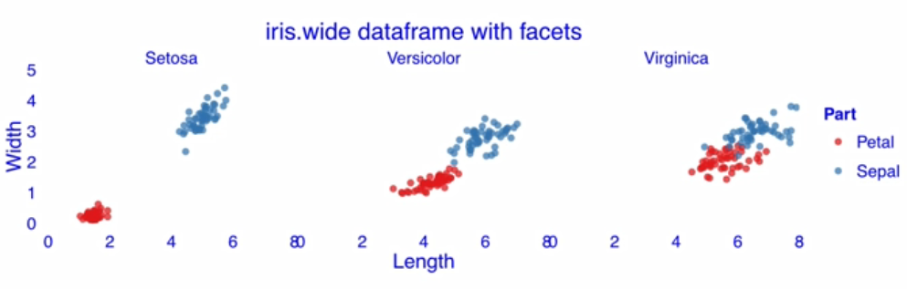
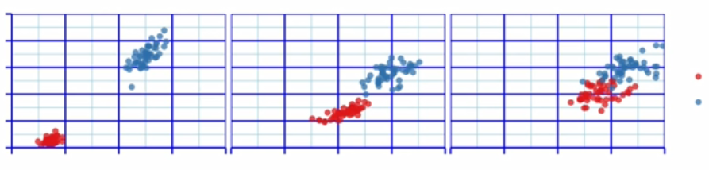
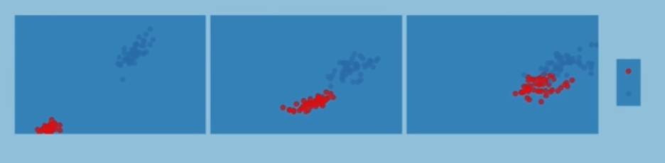
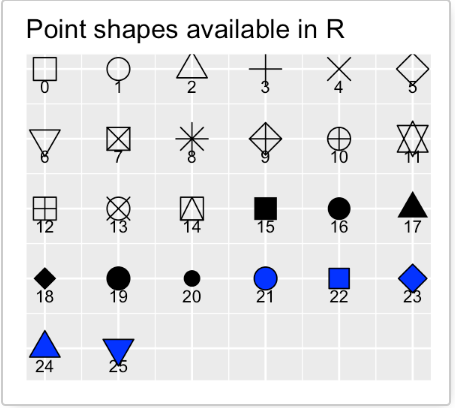
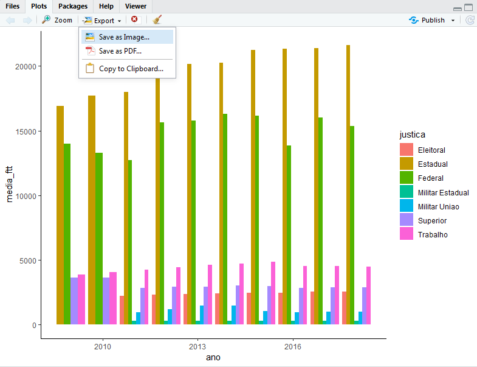

# Visualização de dados

##

<center>  </center>


## Por que construir gráficos?

&nbsp;
&nbsp;

<div style="width: 100%;">

<p style="border:3px; border-style:dashed; border-color:#3D9970; padding: 1em;font-size:30px;"> **ROTA DE FUGA**: </br> Saia desta sala. Vire à direita e caminhe 3 metros até o final do corredor, onde você estará em frente a uma grande sala de conferências. Vire à esquerda e caminhe mais 3 metros até chegar ao final do corredor. À sua esquerda estará um alarme de incêndio, perto do elevador. À sua direita, no final do corredor, há uma escadaria. Não vá ao elevador. Vire à direita e caminhe mais 4 metros até o final do corredor, vire à esquerda e desça pelas escadas. Desça dois lances de escadas e saia do prédio na porta na parte inferior das escadas. </p>

Fonte: Adaptado de Berinato (2016)

</div>


## Por que construir gráficos?

&nbsp;
&nbsp;

<center></center>


## Por que construir gráficos?

<video width="800px" height="700px" controls>
  <source src="dino.mp4" type="video/mp4">
</video>

# Ggplot - Grammar of graphics

## Construção de gráficos em camadas

&nbsp;
&nbsp;

O ggplot é um pacote criado pelo **Hadley Wickham** com o objetivo de operacionalizar a teoria do livro "The Grammar of Graphics" de Leland Wilkinson.

<div style="float: left; width: 50%;">

<center></center>

</div>


<div style="float: right; width: 50%;">

<center></center>

</div>


## Por que o nome gramática de gráficos?

&nbsp;
&nbsp;

A ideia básica do ggplot é a de que um gráfico é construído a partir de camadas de elementos, assim como uma frase:

&nbsp;
&nbsp;

<center><div style="width: 50%;">

 <p style="border:3px; border-style:dashed; border-color:#FF4136; padding: 1em;font-size:40px;"> **A turma está super animada para aprender os próximos códigos** </p>
</div></center>

&nbsp;
&nbsp;

Se os adjetivos, verbos, ou substantivos fossem alterados, o sentido da frase seria totalmente alterado.

## A Gramática dos Gráficos

&nbsp;
&nbsp;

<center></center>


# 1ª Camada: Dados

## Qual é a base a ser utilizada?

&nbsp;
&nbsp;

A primeira camada é a base de dados utilizada para plotar os gráficos. Obviamente, isso ainda não é suficiente para criar um gráfico


```{r include = FALSE}
library(tidyverse)
library(rio)
library(RColorBrewer)
library(plotly)
library(gganimate)
```

```{r fig.align='center'}

#Carregar os pacotes
#library(tidyverse)
#library(rio)

jn <- import("T:\\COVAD\\Curso R\\Aula 3\\jn.xlsx")
ggplot(data=jn)
```

# 2ª Camada: Aesthetics

## Aesthetics

&nbsp;
&nbsp;

A segunda camada (Estética) basicamente consiste em dizer para o R o que vai no eixo X e o que vai no eixo Y

```{r fig.align='center'}
ggplot(data=jn, mapping=aes(x=serv, y=sent))
```


## Aesthetics

&nbsp;
&nbsp;

```{r fig.align='center'}
jn1 <- group_by(jn, ano)
jn1 <- summarise(jn1, media=mean(ftt, na.rm = T))

ggplot(data=jn1, mapping=aes(x=ano, y=media))
```

# 3º Camada: Geometria

## Geometria


&nbsp;
&nbsp;

A terceira camada (Geometria) é a responsável pelos elementos visuais do gráfico

```{r fig.align='center'}

#Usando a geometria de linha
jn1 <- group_by(jn, ano)
jn1 <- summarise(jn1, media=mean(ftt))

ggplot(data=jn1, mapping=aes(x=ano, y=media))+
  geom_line()
```

## Geometria

&nbsp;
&nbsp;

```{r fig.align='center'}
#Usando a geometria de colunas
jn1 <- group_by(jn, ano)
jn1 <- summarise(jn1, media=mean(ftt, na.rm = T))

ggplot(data=jn1, mapping=aes(x=ano, y=media))+
  geom_col()
```

## Geometria

&nbsp;
&nbsp;

```{r fig.align='center'}

#Usando a geometria de área
jn1 <- group_by(jn, ano)
jn1 <- summarise(jn1, media=mean(ftt, na.rm = T))

ggplot(data=jn1, mapping=aes(x=ano, y=media))+
  geom_area()
```

## Geometria

&nbsp;
&nbsp;

```{r fig.align='center'}

#Usando a geometria de pontos
ggplot(data=jn, mapping=aes(x=log(serv), y=log(sent)))+
  geom_point() + 
  labs(x="Total de servidores", y="Total de decisões")
```

## Geometria

&nbsp;
&nbsp;

```{r fig.align='center'}
#Usando a geometria de texto
jn1 <- group_by(jn, ano)
jn1 <- summarise(jn1, media=round(mean(ftt, na.rm = T),0))

ggplot(data=jn1, mapping=aes(x=ano, y=media))+
  geom_label(aes(x=ano, y=media, label=media))
```

## Combinando geometrias

&nbsp;
&nbsp;

```{r fig.align='center'}
#Combinando a geometria de colunas com a de texto
jn1 <- group_by(jn, ano)
jn1 <- summarise(jn1, media=round(mean(ftt, na.rm = T),0))

ggplot(data=jn1, mapping=aes(x=ano, y=media))+
  geom_col()+
  geom_label(aes(x=ano, y=media, label=media),position = position_stack(vjust = 0.5))
```

## Combinando geometrias

&nbsp;
&nbsp;

```{r fig.align='center'}
#Combinando as geometrias de linhas, pontos e texto
jn1 <- group_by(jn, ano)
jn1 <- summarise(jn1, media=round(mean(ftt, na.rm = T),0))

ggplot(data=jn1, mapping=aes(x=ano, y=media))+
  geom_line()+
  geom_point(aes(x=ano, y=media))+
  geom_label(aes(x=ano, y=media, label=media), position = position_stack(vjust=1.08))
```

# 4º Camada: Facet

## Divisão do gráfico

&nbsp;
&nbsp;

A quarta camada, Facet, permite dividir o gráfico criado a partir de uma terceira variável

```{r fig.align='center'}
jn1 <- group_by(jn, ano, justica)
jn1 <- summarise(jn1, media=mean(ftt, na.rm = T))

ggplot(data=jn1, mapping=aes(x=ano, y=media))+
  geom_line()+facet_wrap(~justica, scale="free_y") #Escala "livre" permite uma melhor visualização
```

## Divisão do gráfico

&nbsp;
&nbsp;


```{r fig.align='center'}
ggplot(data=jn, mapping=aes(x=log(serv), y=log(sent)))+
  geom_point()+facet_wrap(~justica)
```


## Divisão do gráfico

&nbsp;
&nbsp;


```{r fig.align='center'}
ggplot(data=jn, mapping=aes(x=log(serv), y=log(sent)))+
  geom_point()+facet_wrap(ano~justica)
```


# 5º Camada: Coordenadas

## Ampliando o gráfico

&nbsp;
&nbsp;

```{r fig.align='center'}
ggplot(data=jn, mapping=aes(x=log(serv), y=log(sent)))+
  geom_point() + 
  labs(x="Total de servidores", y="Total de decisões")+
  coord_cartesian(xlim=c(8,10), ylim=c(9,15))
```

## Invertendo os eixos

&nbsp;
&nbsp;

```{r fig.align='center'}
#Usando a geometria de colunas

jn1 <- group_by(jn, sigla)
jn1 <- summarise(jn1,media=mean(ftt, na.rm = T))
jn1 <- top_n(jn1, n=30, wt=media)
jn1 <- filter(jn1, !sigla %in% c("TJ", "TRF", "TRT", "TRE"))

ggplot(data=jn1, mapping=aes(x=sigla, y=media))+
  geom_col()+
  coord_flip()
```

## Trocando de coordenadas

&nbsp;
&nbsp;

```{r fig.align='center'}
jn1 <- group_by(jn, ano, justica)
jn1 <- summarise(jn1, media=mean(ftt, na.rm = T))
jn1 <- filter(jn1, ano==2018)


ggplot(data=jn1, mapping=aes(x=ano, y=media,fill=justica))+
  geom_col()+
  coord_polar(theta = "x") #variável que será "angularizada"
```

## Trocando de coordenadas

&nbsp;
&nbsp;

```{r fig.align='center'}
jn1 <- group_by(jn, ano, justica)
jn1 <- summarise(jn1, media=round(mean(ftt, na.rm = T),2))
jn1 <- filter(jn1, ano==2018)


ggplot(data=jn1, mapping=aes(x=ano, y=media,fill=justica))+
  geom_col()+
  geom_label(aes(label=media), position=position_stack(vjust=0.5))+
  coord_polar("y")
```

# 6º Camada: Tema

## Tipos de temas

&nbsp;
&nbsp;

Existem três elementos visuais (isto é, que não são dados) que podemos alterar nesta camada usando a função theme():

<center> **Textos**</center>

<center></center>


## Tipos de temas

&nbsp;
&nbsp;

<center> **Linhas**</center>

<center></center>


## Tipos de temas

&nbsp;
&nbsp;

<center> **Retângulos**</center>

<center></center>

## Hierarquia

&nbsp;
&nbsp;

Cada um dos elementos do gráfio pode ser modificado individualmente, por exemplo: Título do gráfico, título do eixo x,  linha do eixo y, retângulo da legenda, etc.

Porém, caso se deseje alterar todos os elementos textuais, linhas ou retângulos, podemos utilizar um dos três elementos abaixo:

* text

* line

* rect

## Deixando apenas os dados

&nbsp;
&nbsp;

```{r fig.align='center'}
ggplot(data=jn, mapping=aes(x=log(serv), y=log(sent)))+
  geom_point()+
  theme(text=element_blank(),
        line=element_blank(),
        rect = element_blank())
```


## Modificando os textos

&nbsp;
&nbsp;

```{r fig.align='center'}
jn1 <- group_by(jn, sigla)
jn1 <- summarise(jn1,media=mean(ftt, na.rm = T))
jn1 <- top_n(jn1, n=30, wt=media)
jn1 <- filter(jn1, !sigla %in% c("TJ", "TRF", "TRT", "TRE"))

ggplot(data=jn1, mapping=aes(x=sigla, y=media))+
  geom_col()+
  ggtitle("Teste")+
  theme(axis.title = element_text(color = "red", hjust = 0.5, face = "bold", family= "serif"),
        axis.text.x = element_text(color = "black", angle = 45, family="sans"),
        plot.title = element_text(color="blue", face="bold", hjust=0.5, family="serif", size=20))
  
```


## Modificando as linhas

&nbsp;
&nbsp;

```{r fig.align='center'}
ggplot(data=jn, mapping=aes(x=log(serv), y=log(sent)))+
  geom_point()+
  theme(panel.grid = element_line(color="blue", size=2),
        axis.line = element_line(color = "red", size=3))
```

## Modificando os retângulos

&nbsp;
&nbsp;

```{r fig.align='center'}
ggplot(data=jn, mapping=aes(x=log(serv), y=log(sent), color=justica))+
  geom_point()+
  theme(plot.background = element_rect(fill = "#DDDDDD", color="black",
                                       size=3),
        panel.background = element_rect(fill="white", color="black", size=1),
        legend.background = element_rect(fill="#7FDBFF", color="black"),
        legend.key=element_rect(fill="#0074D9", color="black"))
```


## Temas completos - templates

&nbsp;
&nbsp;

Se vocês não estão dispostos a mudar cada detalhe dos seu gráfico, podemos usar os templates fornecidos pelo ggplot: classic, dark, grey, bw, light, etc.

```{r fig.align='center'}
ggplot(data=jn, mapping=aes(x=log(serv), y=log(sent), color=justica))+
  geom_point()+
  theme_classic()
```


## Temas completos - templates

&nbsp;
&nbsp;

```{r fig.align='center'}
ggplot(data=jn, mapping=aes(x=log(serv), y=log(sent), color=justica))+
  geom_point()+
  theme_dark()
```

## Temas completos - templates

&nbsp;
&nbsp;

```{r fig.align='center'}
ggplot(data=jn, mapping=aes(x=log(serv), y=log(sent), color=justica))+
  geom_point()+
  theme_bw()
```

## Temas completos - templates

&nbsp;
&nbsp;

```{r fig.align='center'}
ggplot(data=jn, mapping=aes(x=log(serv), y=log(sent), color=justica))+
  geom_point()+
  theme_light()
```


## Temas completos - templates

&nbsp;
&nbsp;

```{r fig.align='center'}
ggplot(data=jn, mapping=aes(x=log(serv), y=log(sent), color=justica))+
  geom_point()+
  theme_void()
```

# Extras: Geometria - Mudando os atributos visuais

## Mudando a cor

&nbsp;
&nbsp;

```{r fig.align='center'}
ggplot(data=jn, mapping=aes(x=log(serv), y=log(sent)))+
  geom_point(color="red")+
  theme_classic()
```

## Mudando o tamanho

&nbsp;
&nbsp;

```{r fig.align='center'}
ggplot(data=jn, mapping=aes(x=log(serv), y=log(sent)))+
  geom_point(color="blue", size=3)+
  theme_classic()
```

## Mudando a transparência

&nbsp;
&nbsp;

```{r fig.align='center'}
ggplot(data=jn, mapping=aes(x=log(serv), y=log(sent)))+
  geom_point(color="blue", size=3, alpha=0.1)+
  theme_classic()
```


## Mudando o tipo (shape)

&nbsp;
&nbsp;

<center></center>

## Mudando o tipo (shape)

&nbsp;
&nbsp;

```{r fig.align='center'}
ggplot(data=jn, mapping=aes(x=log(serv), y=log(sent)))+
  geom_point(color="blue", size=3, alpha=0.4, shape=11)+
  theme_classic()
```


## Mudando os atributos de colunas

&nbsp;
&nbsp;

```{r fig.align='center'}
jn1 <- group_by(jn, ano)
jn1 <- summarise(jn1, media=round(mean(ftt, na.rm = T),0))

ggplot(data=jn1, mapping=aes(x=ano, y=media))+
  geom_col(color="black", fill="steelblue", width = 0.2, alpha=0.6)+
  theme_classic()
```

## Mudando os atributos de linhas

&nbsp;
&nbsp;

```{r fig.align='center'}
jn1 <- group_by(jn, ano)
jn1 <- summarise(jn1, media=round(mean(ftt, na.rm = T),0))

ggplot(data=jn1, mapping=aes(x=ano, y=media))+
  geom_line(color="steelblue", size=2,linetype=2)+
  geom_point(aes(x=ano, y=media),color="red", fill="green", size=3, shape=23)
```

# Extra: Aesthetics - Aumentando as dimensões

## Aumentando as dimensões

&nbsp;
&nbsp;

Geralmente, precisamos plotar gráficos com mais de 2 duas dimensões. Existem vários argumentos para realizar essa tarefa, como color, group, size, shape, etc. **Obs: Alguns argumentos somente funcionam para alguns tipos de geometrias**

```{r fig.align='center'}
ggplot(data=jn, mapping=aes(x=log(serv), y=log(sent), color=log(mage)))+
  geom_point()+
  theme_classic()
```


## Aumentando as dimensões

&nbsp;
&nbsp;

```{r fig.align='center'}
ggplot(data=jn, mapping=aes(x=log(serv), y=log(sent), size=log(mage)))+
  geom_point()+
  theme_classic()
```


## Aumentando as dimensões

&nbsp;
&nbsp;

```{r fig.align='center'}
ggplot(data=jn, mapping=aes(x=log(serv), y=log(sent), label=sigla))+
  geom_text()+
  theme_classic()
```

## Aumentando as dimensões

&nbsp;
&nbsp;

```{r fig.align='center'}
jn1 <- group_by(jn, ano, justica)
jn1 <- summarise(jn1, media=mean(ftt, na.rm = T))

ggplot(data=jn1, mapping=aes(x=ano, y=media, color=justica))+
  geom_line()+
  labs(x="Ano", y="Media de força de trabalho", col="Tipo de Justiça")+
  theme_classic()
```

## Aumentando as dimensões

&nbsp;
&nbsp;

```{r fig.align='center'}
jn1 <- group_by(jn, ano, justica)
jn1 <- summarise(jn1, media=mean(ftt, na.rm = T))

ggplot(data=jn1, mapping=aes(x=ano, y=media, linetype=justica))+
  geom_line()+
  theme_classic()
```

## Aumentando as dimensões

&nbsp;
&nbsp;

```{r fig.align='center'}
jn1 <- group_by(jn, ano, justica)
jn1 <- summarise(jn1, media=mean(ftt, na.rm = T))

ggplot(data=jn1, mapping=aes(x=ano, y=media, size=justica))+
  geom_line()+
  theme_classic()
```

## Aumentando as dimensões

&nbsp;
&nbsp;

```{r fig.align='center'}
jn1 <- group_by(jn, ano, justica)
jn1 <- summarise(jn1, media=mean(ftt, na.rm = T))

ggplot(data=jn1, mapping=aes(x=ano, y=media, fill=justica))+
  geom_col()+
  theme_classic()
```

## Aumentando as dimensões

&nbsp;
&nbsp;

```{r fig.align='center'}
jn1 <- group_by(jn, ano, justica)
jn1 <- summarise(jn1, media=mean(ftt, na.rm = T))

ggplot(data=jn1, mapping=aes(x=ano, y=media, fill=justica))+
  geom_area()+
  theme_classic()
```

## Mudando manualmente as cores

&nbsp;
&nbsp;

```{r fig.align='center'}

cores <- c("#1B9E77","#D95F02","#7570B3","#E7298A",
           "#66A61E", "#E6AB02","#A6761D")

nomes <- c("Elec.", "Est.", "Fed.", "M.Est.", "M.União",
           "Sup.", "Trab.")

ggplot(data=jn, mapping=aes(x=log(serv), y=log(sent), color=justica))+
  geom_point(alpha = 0.4)+
  theme_classic()+
  scale_color_manual("Tipo de justiça",
                    values = cores,
                    labels = nomes)

```

## Mudando manualmente as cores

&nbsp;
&nbsp;

```{r fig.align='center'}

cores <- c("#1B9E77","#D95F02","#7570B3","#E7298A",
           "#66A61E", "#E6AB02","#A6761D")

nomes <- c("Elec.", "Est.", "Fed.", "M.Est.", "M.União",
           "Sup.", "Trab.")

ggplot(data=jn, mapping=aes(x=log(serv), y=log(sent), fill=justica))+
  geom_point(shape = 23, size = 5, alpha = 0.4)+
  theme_classic()+
  scale_fill_manual("Tipo de justiça",
                    values = cores,
                    labels = nomes)

```

## Mudando manualmente as cores

&nbsp;
&nbsp;

```{r fig.align='center'}
jn1 <- group_by(jn, ano, justica)
jn1 <- summarise(jn1, media=mean(ftt, na.rm = T))

cores <- c("#1B9E77","#D95F02","#7570B3","#E7298A",
           "#66A61E", "#E6AB02","#A6761D")

nomes <- c("Elec.", "Est.", "Fed.", "M.Est.", "M.União",
           "Sup.", "Trab.")

ggplot(data=jn1, mapping=aes(x=ano, y=media, fill=justica))+
  geom_col()+
  scale_fill_manual("Tipo de justiça",
                    values = cores,
                    labels = nomes)+
  theme_classic()
```


# Extras: Geometria - mudando a posição

## O que fazer quando há sobreposição?

&nbsp;
&nbsp;

Com frequência, observamos uma sobreposição dos dados da nossa base. Para resolver isso, podemos usar o argumento position dentro da função de geometria

```{r fig.align='center'}
ggplot(data=jn, mapping=aes(x=log(serv), y=log(sent), color=log(mage)))+
  geom_point(position="jitter")+
  theme_classic()
```


## O que fazer quando há sobreposição?

&nbsp;
&nbsp;

```{r fig.align='center'}
 
ggplot(data=jn, mapping=aes(x=log(serv), y=log(sent), color=log(mage)))+
  geom_point(position=position_jitter(width=2))+#Especificar a distância de cada ponto
  theme_classic() 
```


## O que fazer quando há sobreposição?

&nbsp;
&nbsp;

```{r fig.align='center'}
jn1 <- group_by(jn, ano, justica)
jn1 <- summarise(jn1, media_ftt=mean(ftt, na.rm = T), media_remun_serv=mean(g10b, na.rm = T)) #várias médias para o mesmo ano

ggplot(data=jn1, mapping=aes(x=ano, y=media_ftt, fill=justica))+
  geom_col(position = "dodge")+
  theme_classic()
```

## O que fazer quando há sobreposição?

&nbsp;
&nbsp;

```{r fig.align='center'}
jn1 <- group_by(jn, ano, justica)
jn1 <- summarise(jn1, media_ftt=mean(ftt, na.rm = T), media_remun_serv=mean(g10b, na.rm = T)) #várias médias para o mesmo ano

ggplot(data=jn1, mapping=aes(x=ano, y=media_ftt, fill=justica))+
  geom_col(position = position_dodge(width = 1), alpha=0.6)+
  theme_classic()
```

# Extras: Personalizando as cores


## Paletas de cores

&nbsp;
&nbsp;

O pacote RColorBrewer fornece paletas de cores que podem ser utilizadas nos gráficos

```{r fig.align='center'}
#install.packages("RColorBrewer")
#library(RColorBrewer)
display.brewer.all()
```

## Paleta para daltônicos

&nbsp;
&nbsp;

```{r fig.align='center'}
display.brewer.all(colorblindFriendly = TRUE)
```

## Uma paleta específica

&nbsp;
&nbsp;

```{r fig.align='center'}
display.brewer.pal(n = 8, name = 'Dark2')
```

## Obtendo as cores

&nbsp;
&nbsp;

```{r fig.align='center'}
brewer.pal(n = 8, name = "Dark2")
```

# Extras: Adicionando interatividade

## Plotly

Caso o output do R seja um HTML, podemos adicionar um pouco de interatividade aos gráficos usando o pacote Plotly

```{r fig.align='center'}
#install.packages("plotly")
#library(plotly)
jn1 <- group_by(jn, ano, justica)
jn1 <- summarise(jn1, media=mean(ftt, na.rm = T))

plot <- ggplot(data=jn1, mapping=aes(x=ano, y=media, fill=justica))+
  geom_col()+
  theme_classic()

ggplotly(plot)
```

# Extras: Salvando os plots no diretório


## 1º Forma

&nbsp;
&nbsp;

<center></center>

## 2º Forma

&nbsp;
&nbsp;

```{r}

jn1 <- group_by(jn, ano, justica)
jn1 <- summarise(jn1, media=mean(ftt, na.rm = T))

plot1 <- ggplot(data=jn1, mapping=aes(x=ano, y=media, fill=justica))+
  geom_col()+
  theme_classic()

#setwd() - Escolhe o diretório

#ggsave("plot1.png", plot=plot1, width = 30, height = 20, units = "cm")
#ggsave("plot1.pdf", plot=plot1, width = 10, height = 30, units = "cm")
```


# Bônus: Animando os gráficos

## Animando os gráficos

&nbsp;
&nbsp;

É possível transformar os gráficos em animação com o pacote gganimate

&nbsp;
&nbsp;

```{r fig.align='center'}
#install.packages("gganimate")
#install.packages("gifski")
#library(gganimate)

jn1 <- filter(jn, sigla %in% c("TJMG", "TJRJ", "TJRS", "TJPR", "TRF1", "TJSC",
                               "TJPR", "TJBA", "TRF4", "TRF3"))

jn1$ano <- as.integer(jn1$ano)

p <- ggplot(data=jn1, mapping=aes(x=serv, y=sent, color=sigla))+
  geom_point(alpha=0.3, size=4)+
  theme_classic()+
  labs(x="Total de servidores", y="Total de Decisões")

```

## Animando os gráficos

&nbsp;
&nbsp;

```{r fig.align='center'}
p + transition_time(ano) +
  labs(title = "Ano: {frame_time}")
```


## Fim

&nbsp;
&nbsp;

<div style="width: 100%;">

 <p style="font-size:40px;"> <center> Caminhante, não há caminho </center> </br> <center>  O caminho se faz ao caminhar </center> </p> 

*Antônio Machado*, poeta espanhol

</div>
